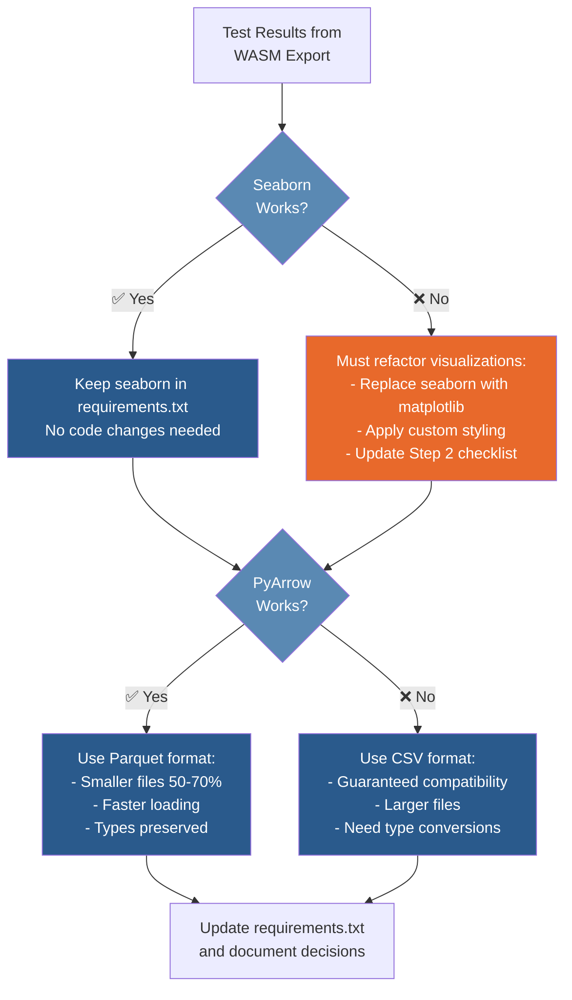
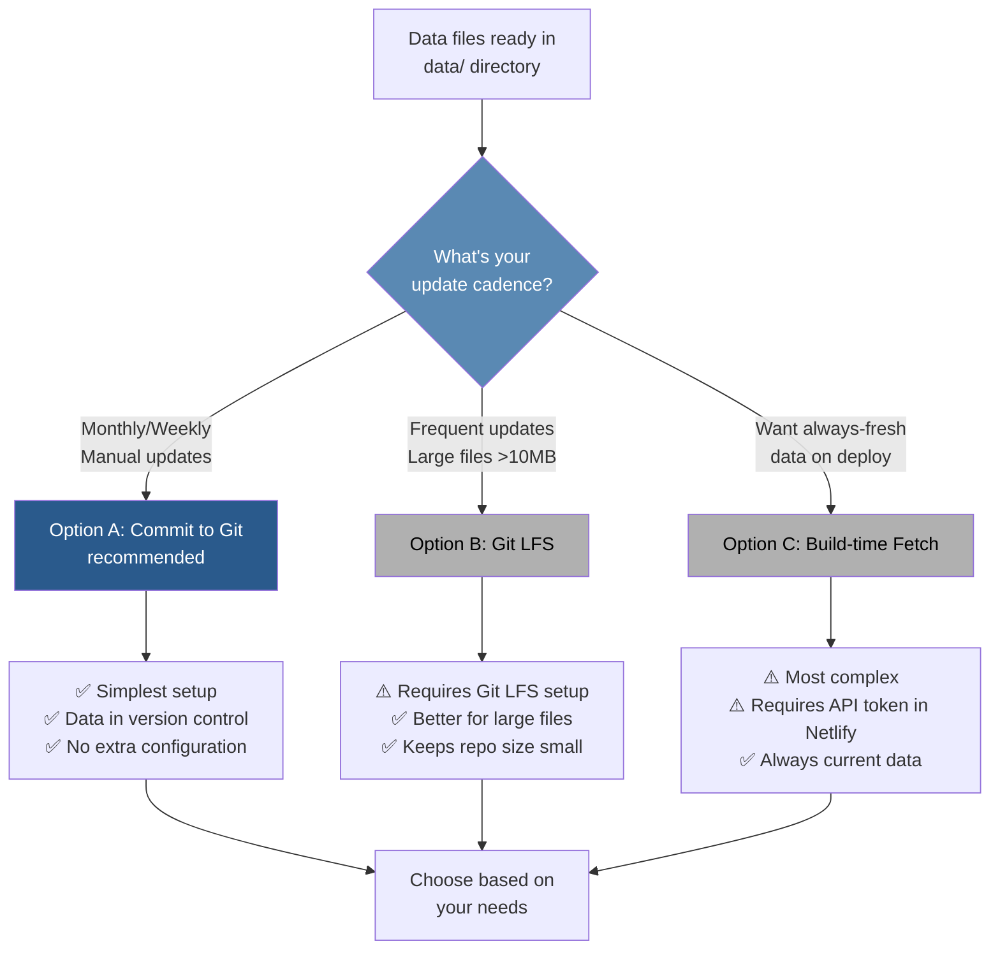

# `citytracker`: Civic Data Dashboard, Powered by [Marimo](https://marimo.io/) & [Netlify](https://www.netlify.com/)

[View Dashboard on molab](https://molab.marimo.io/notebooks/nb_yhv6b2amYTK5SRpp9axJnF)
*Last Updated: 2/15/2026 13:21:43*


> [!NOTE]
> ***Why use this particular method to publish a data dashboard?***
> The Marimo --> Netlify workflow provides the following strategic benefits:
>
> - **Unified dashboard** for all sites
>
> - **Preview deployments** for every branch (critical for client review)
>
> - **Git-based workflow** (push to deploy)
>
> - **Custom domain management** per project
>
> - **No server costs** or maintenance
>
> - **Scales automatically** to traffic
>
>These workflow advantages outweigh the package compatibility constraints for this use case.


---

## Repository Structure

```
citytracker/
├── notebooks/
│   ├── citytracker.py              # Main dashboard [TODO] Switch data source from API to local storage 
│   ├── fetch-housing-data.py       # [TODO] Data fetching notebook (run locally)
│   └── test-wasm-packages.py       # [TODO] Package compatibility testing
├── data/
│   ├── housing.parquet             # [TODO] Static housing data (or .csv)
│   └── housing_metadata.json       # [TODO] Last updated timestamp and row count
├── docs/
│   ├── images/
│   ├── reference-information/
│   └── tutorials-and-guides/
│       └── Publishing Marimo to Netlify Guide.md
├── requirements.txt                # ✅ Created, needs WASM compatibility verification
├── netlify.toml                    # [TODO] Build configuration
├── .gitignore                      # ✅ Created
└── README.md
```


## Current Status

Currently deployed on Marimo's molab platform. In progress: migrating to self-hosted Netlify deployment using WASM export for improved workflow management, custom domain support, and preview deployments.


## ✅ Completed

- [x] Repository structure created (notebooks/, data/, docs/)
- [x] requirements.txt created with core packages
- [x] .gitignore configured
- [x] Git repository initialized and commits made
- [x] Style guide created and translated to css
- [x] First relevant data source identified on https://opendata.cityofnewyork.us/ and data exported via API 
- [x] Main notebook functional with seaborn visualizations and interactive widgets


## 🚧 Next Steps

### ☐ 01. Perform WASM compatibility testing 

> [!CAUTION]
> ***Test whether current visualization approach will work in WASM deployment.***


- [ ] Create `notebooks/test-wasm-packages.py` with test cells for:
  - seaborn (critical - used for all current visualizations)
  - PyArrow (if planning to use Parquet)
  - great-tables (imported but not currently used)
- [ ] Export test notebook to WASM:
  ```bash
  marimo export html-wasm notebooks/test-wasm-packages.py -o test-dist --mode run
  ```
- [ ] Test locally:
  ```bash
  cd test-dist && python -m http.server 8000
  # Open http://localhost:8000 in browser, check console (F12) for errors
  ```
> [!IMPORTANT]
> ***DECISION POINT: Package compatibility results will determine the path forward:***



- [ ] Update requirements.txt based on test results
- [ ] Document test results below in "WASM Compatibility Results" section

---

### ☐ 02. Update data architecture

- [ ] Create `notebooks/fetch-housing-data.py` notebook
- [ ] Implement data fetching from Socrata API:
  - Use existing API code from `citytracker.py` (lines 207-246)
  - Filter to only needed columns:
    - borough
    - project_start_date, project_completion_date
    - extremely_low_income_units through other_income_units (6 columns)
  - Limit to 100,000 rows or appropriate subset
- [ ] Save data in chosen format:
  - `pd.to_csv('data/housing.csv', index=False)` OR
  - `pd.to_parquet('data/housing.parquet', index=False')` OR
  - Save both for flexibility
- [ ] Create `data/housing_metadata.json`:
  ```python
  import json
  from datetime import datetime
  metadata = {
      "last_updated": datetime.now().isoformat(),
      "row_count": len(housing),
      "source": "NYC Open Data - hg8x-zxpr",
      "columns": list(housing.columns)
  }
  json.dump(metadata, open('data/housing_metadata.json', 'w'), indent=2)
  ```
- [ ] Run fetch notebook locally to generate data files
- [ ] Verify file size acceptable for browser download (<10 MB preferred)
- [ ] Test loading data from both notebook locations:
  - From citytracker.py: `pd.read_csv('../data/housing.csv')`
  - Verify path works correctly

---

### ☐ 03. Refactor main notebook

- [ ] In `notebooks/citytracker.py`, replace API data loading (lines 207-246):
  - Remove: `from dotenv import load_dotenv`
  - Remove: `from sodapy import Socrata`
  - Remove: `load_dotenv()`, `os.getenv()`, Socrata client code
  - Replace with: `housing = pd.read_csv('../data/housing.csv')` (or read_parquet)
- [ ] Handle data types:
  - If using CSV: keep existing type conversion code (lines 253-265)
  - If using Parquet: remove type conversion (types preserved automatically)
- [ ] Add data freshness indicator cell (after line 337):
  ```python
  @app.cell(hide_code=True)
  def _(mo):
      import json
      metadata = json.load(open('../data/housing_metadata.json'))
      mo.md(f"*Data last updated: {metadata['last_updated']}*")
  ```
- [ ] Update requirements.txt:
  - Remove: `python-dotenv`
  - Remove: `sodapy`
  - Keep or remove: `great-tables` (if unused)
- [ ] **IF seaborn incompatible:** Refactor visualizations to matplotlib
- [ ] Test notebook locally: `marimo run notebooks/citytracker.py`
- [ ] Verify data loads correctly and visualizations work

---

### ☐ 04. Double-check WASM compatibility

- [ ] Export main notebook to WASM:
  ```bash
  marimo export html-wasm notebooks/citytracker.py -o dist --mode run
  ```
- [ ] Serve locally:
  ```bash
  cd dist && python -m http.server 8000
  ```
- [ ] Open http://localhost:8000 in browser and verify:
  - [ ] Notebook loads without errors (check browser console with F12)
  - [ ] Data displays correctly
  - [ ] Year dropdown widget works
  - [ ] Housing type dropdown widget works
  - [ ] Bar chart renders correctly
  - [ ] Data freshness indicator shows correct timestamp
  - [ ] Initial load time acceptable (5-15 seconds for Pyodide is normal)
- [ ] Test on multiple browsers (Chrome, Firefox, Safari)
- [ ] If any issues found, debug and retest

---

### ☐ 05. Set up Netlify configuration

- [ ] Create `netlify.toml` in project root:
  ```toml
  [build]
    command = "pip install marimo -r requirements.txt && marimo export html-wasm notebooks/citytracker.py -o dist --mode run"
    publish = "dist"
  
  [build.environment]
    PYTHON_VERSION = "3.11"
  ```
- [ ] Update `.gitignore` to include test artifacts:
  ```
  test-dist/
  ```
> [!IMPORTANT]
> ***DECISION POINT: Decide on a data version control strategy:***



  - **Option A (recommended):** Commit data files to git
    - Simplest approach
    - Fine for monthly/weekly updates
    - Data automatically included in deployments
  - **Option B:** Use Git LFS for data files
    - Better for frequent large file updates
    - Requires Git LFS setup
  - **Option C:** Fetch during Netlify build
    - Requires modifying build command to run fetch notebook
    - Requires storing API token in Netlify environment variables
    - More complex but always fresh data
- [ ] Stage and commit all changes:
  ```bash
  git add .
  git status  # Review changes
  git commit -m "Configure for Netlify WASM deployment"
  ```

---

### ☐ 06. Deploy to Netlify (via GitHub)

- [ ] Create new GitHub repository (if not exists): https://github.com/new
- [ ] Push to GitHub:
  ```bash
  git remote add origin https://github.com/yourusername/citytracker.git
  git branch -M main
  git push -u origin main
  ```
- [ ] Log in to Netlify: https://app.netlify.com
- [ ] Add new site → Import existing project → GitHub
- [ ] Select citytracker repository
- [ ] Verify build settings (should auto-detect from netlify.toml):
  - Build command: `pip install marimo -r requirements.txt && marimo export html-wasm notebooks/citytracker.py -o dist --mode run`
  - Publish directory: `dist`
  - Python version: 3.11
- [ ] Click "Deploy site"
- [ ] Monitor build logs for errors
- [ ] Once deployed, test live site:
  - [ ] Notebook loads (expect 5-15 seconds for Pyodide)
  - [ ] All interactive features work
  - [ ] Data displays correctly
  - [ ] Test on mobile device
- [ ] (Optional) Configure custom domain:
  - Site settings → Domain management → Add custom domain
  - Follow DNS configuration instructions
  - Wait for HTTPS certificate provisioning
- [ ] Document final deployment URL in this README

---


## Future Planning: 

### Data Update Workflow

*(After deployment is complete)*

When HPD publishes new housing data:

1. Run `marimo edit notebooks/fetch-housing-data.py` locally
2. Execute all cells to fetch fresh data from Socrata API
3. Verify `data/housing.csv` and `data/housing_metadata.json` updated
4. Review data for anomalies: `housing.info()`, `housing.describe()`
5. Commit changes:
   ```bash
   git add data/
   git commit -m "Update housing data: [date]"
   git push
   ```
6. Netlify auto-deploys (2-3 minutes)
7. Visit live site and verify data freshness indicator updated

---


## Data Sources:

### Dataset 01: Affordable Housing Production by Building
**Agency:** NYC Department of Housing Preservation and Development (HPD)
**Endpoint:** hg8x-zxpr
**URL:** https://data.cityofnewyork.us/Housing-Development/Affordable-Housing-Production-by-Building/hg8x-zxpr/about_data
**Data Dictionary:** https://data.cityofnewyork.us/api/views/hg8x-zxpr/files/b960c601-e951-4103-9414-223adef41fce?download=true&filename=Affordable%20Housing%20Production%20by%20Building%20Data%20Dictionary.xlsx
**Update Frequency:** [TODO: Verify with HPD]

---


## Key Resources:

- **Pyodide Package List:** https://pyodide.org/en/stable/usage/packages-in-pyodide.html
- **Marimo WASM Export:** https://docs.marimo.io/guides/exporting.html
- **Netlify Documentation:** https://docs.netlify.com

---


## Development Notes:

### WASM Compatibility Testing Method

**Most reliable approach:**

1. Create minimal test notebook importing only the package being tested
2. Export to WASM: `marimo export html-wasm test.py -o test-dist --mode run`
3. Serve locally: `cd test-dist && python -m http.server 8000`
4. Open http://localhost:8000 and check browser console (F12) for errors

**Critical:** Only two sources are reliable for WASM compatibility:
1. Official Pyodide package list
2. Actual WASM export testing

Do NOT assume "pure Python" or "dependencies available" means a package will work.

### WASM Compatibility Results

*(Document test results here after Step 0)*

**Tested:** [Date]

| Package | Status | Notes |
|---------|--------|-------|
| seaborn | [✅/❌] | [Result and any issues] |
| pyarrow | [✅/❌] | [Result and any issues] |
| great-tables | [✅/❌] | [Result and any issues] |

**Final Package List for requirements.txt:**
```
[To be determined after testing]
```

---

